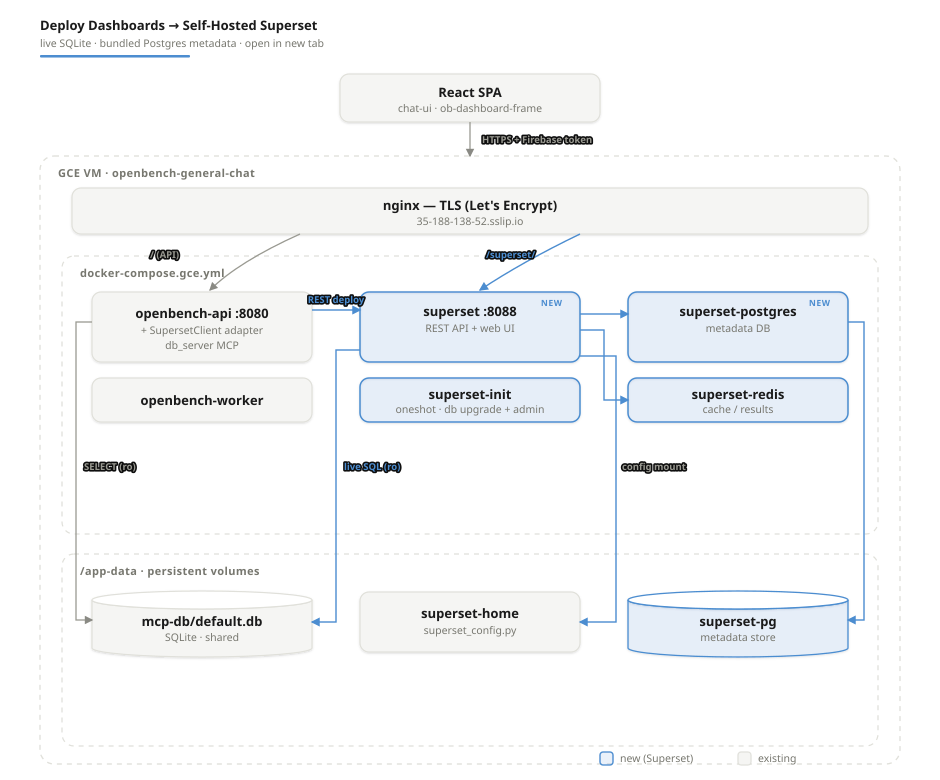
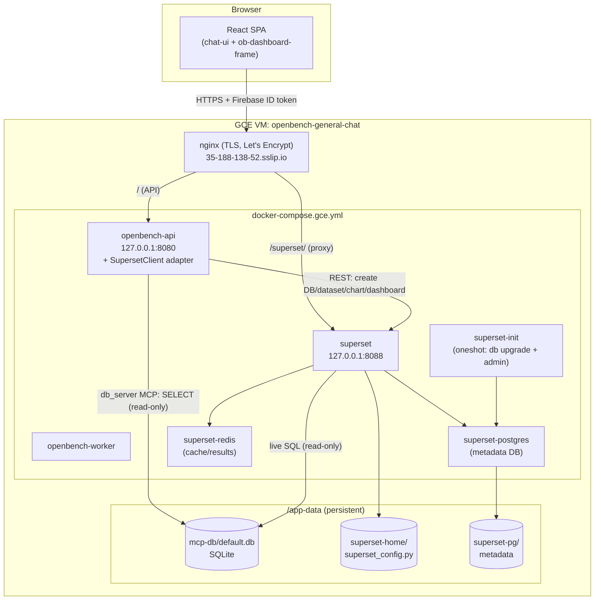
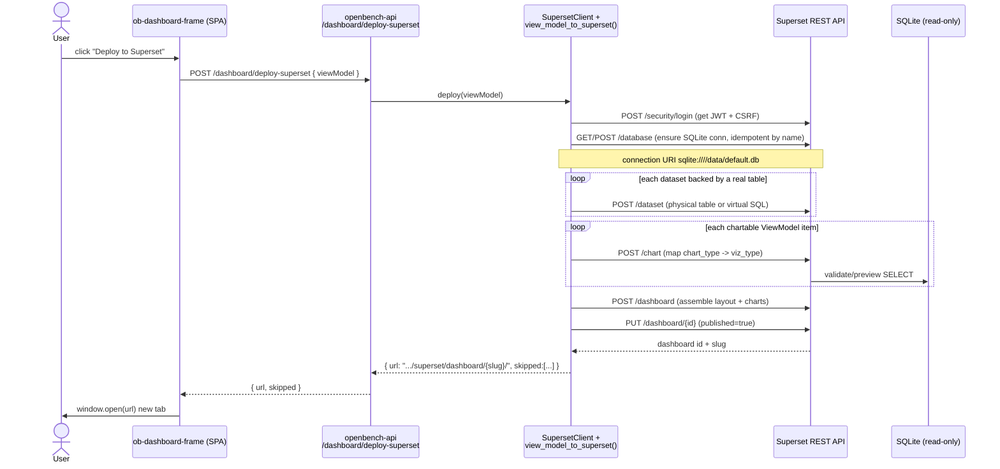
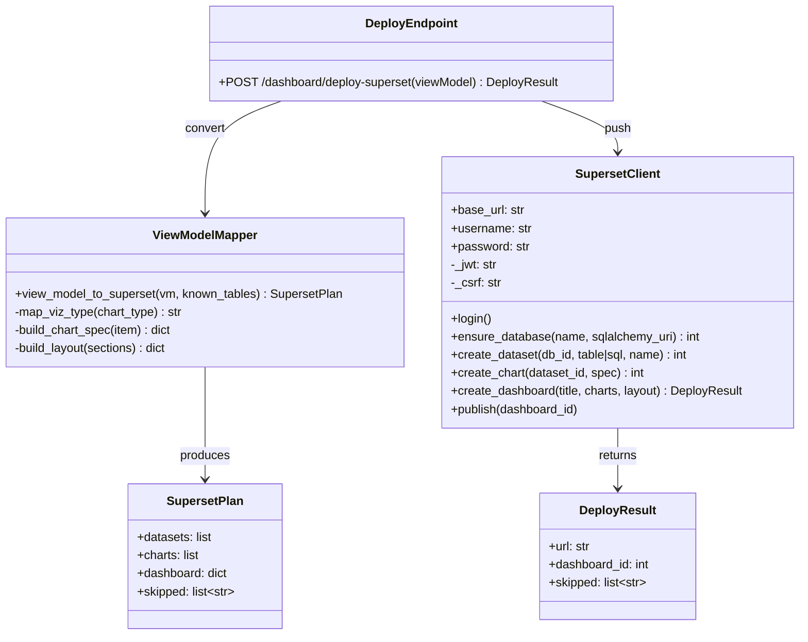

# Deploy Dashboards to Self-Hosted Superset (live Postgres)

**Status:** Design / RFC. Not yet implemented.

> **Update:** the data layer moved from SQLite to **Cloud SQL Postgres** (the
> `appdata` database — see [deploy/DEPLOY.md](../deploy/DEPLOY.md)). Superset now
> connects to Postgres as a first-class source: **no** `PREVENT_UNSAFE_DB_CONNECTIONS`
> hack, **no** SQLite WAL/read-only file-mount traps. The agent materializes
> computed datasets into `mart.*` (via the `db_server` MCP's `materialize_query`),
> so they become real tables Superset can chart live. The diagram/prose below
> still say "SQLite" in places — read those as Postgres `appdata`.

## Context

The general-chat app already generates dashboards: the agent produces a
**ViewModel** (`title`, `datasets`, `kpis`, `sections[].items[]`) via
`DashboardGenerator`, and the chat UI renders it in
[`ob-dashboard-frame.tsx`](../studio/chat-ui/src/a2ui/custom/ob-dashboard-frame.tsx).
That frame already exposes header actions **Publish / Export Grafana / Export
PDF**, wired through the optional `ChatContext.dashboardActions` hook. An
existing precedent —
[`view_model_to_grafana()`](../examples/general-chat/src/general_chat/server/grafana.py)
— converts a ViewModel into an external dashboard vendor's JSON model.

Goal: a **"Deploy to Superset"** button. Click it, and OpenBench pushes the
current dashboard into a **self-hosted Apache Superset** instance running
alongside the API, with Superset connected to the **same SQLite DB**
(`/app-data/mcp-db/default.db`) the `db_server` MCP already uses. Deploy returns
a Superset URL the user opens in a new tab.

This design follows the existing Grafana-export pattern rather than inventing
new core abstractions.

### Locked decisions
- **Data path:** Superset connects **live** to Cloud SQL Postgres (`appdata`) via
  the same `cloud-sql-proxy` sidecar the `db_server` MCP uses. Charts run real SQL
  against `public.*` (seeded) and `mart.*` (agent-materialized) tables.
- **Superset metadata DB:** a **bundled Postgres container** on the VM,
  dedicated to Superset (separate from `appdata`).
- **View mode:** deploy returns a **URL opened in a new tab** (no embedding).

### Key constraint (live tables)
Superset charts must map to **real tables**. Agent-computed inline datasets that
exist only in the ViewModel are handled by **materializing** them first:
- ViewModel `datasets` backed by a real table (`public.*`/`mart.*`) → charted directly.
- Inline-only datasets → the agent calls `materialize_query` (db_server MCP) to
  persist them as `mart.<name>`, then Superset charts that table.

Postgres is a first-class Superset datasource — no `PREVENT_UNSAFE_DB_CONNECTIONS`
override and no read-only file-mount are needed (both were SQLite-only concerns).

---

## Architecture

### System / deployment diagram

Both `openbench-api` (via `db_server` MCP) and `superset` read the **same
SQLite file**. API mounts it read/write (existing); Superset mounts it
**read-only** at the same in-container path `/data/default.db`.

### Deploy sequence diagram

### Adapter class diagram

### ViewModel → Superset mapping

| ViewModel | Superset | Notes |
|-----------|----------|-------|
| `datasets[key]` where `key` is a real SQLite table | Physical dataset over that table | Live SQL |
| `sections[].items[]` chart with `dataset` ref | Chart bound to that dataset | `x`/`y` → dimensions/metrics |
| `chart_type` bar/line/area/pie/scatter | `viz_type` echarts_timeseries_bar/line/area/pie/scatter | `map_viz_type()` |
| `kpis[]` | Big Number chart | value/metric via SQL `SELECT` |
| `sections` order + items | Dashboard grid layout (position_json) | `build_layout()` |
| inline-only dataset (no table) | — | skipped, returned in `skipped[]` |

---

## Implementation plan

### 1. Infra — docker-compose + Superset config
- **`docker-compose.gce.yml`**: add four services, all bound to localhost:
  - `superset` (image `apache/superset` pinned to a version), port
    `127.0.0.1:8088:8088`, env `SUPERSET_CONFIG_PATH=/app/superset_config.py`,
    volumes: `superset-home` (config) + SQLite **read-only**
    (`${MCP_DB_DATA_PATH}:/data:ro`).
  - `superset-init` (same image, `command:` runs `superset db upgrade`,
    `superset fab create-admin`, `superset init`; `restart: "no"`).
  - `superset-postgres` (`postgres:16`), volume `/app-data/superset-pg`.
  - `superset-redis` (`redis:7`) for cache + Celery results.
- **`deploy/superset/superset_config.py`** (new): `SECRET_KEY` (from env),
  `SQLALCHEMY_DATABASE_URI` → superset-postgres, Redis cache config,
  `PREVENT_UNSAFE_DB_CONNECTIONS = False` (allow SQLite),
  `ENABLE_PROXY_FIX = True` + base-URL settings so Superset works under the
  `/superset/` subpath.
- **`deploy/nginx-openbench-api.conf`**: add `location /superset/ { proxy_pass
  http://127.0.0.1:8088/; ... }` (websocket upgrade headers for live features).
- **`.env.example.gcp`**: add `SUPERSET_SECRET_KEY`, `SUPERSET_ADMIN_USER`,
  `SUPERSET_ADMIN_PASSWORD`, `SUPERSET_DB_PASSWORD`, `SUPERSET_PUBLIC_URL`
  (e.g. `https://35-188-138-52.sslip.io/superset`). Real values only in VM
  `.env.gcp`.

### 2. Backend adapter (mirror the Grafana pattern)
- **`examples/general-chat/src/general_chat/server/superset.py`** (new):
  - `view_model_to_superset(vm, known_tables)` — pure mapping →
    datasets/charts/dashboard payloads + `skipped` list. Mirrors
    `grafana.py:view_model_to_grafana` structure.
  - `SupersetClient` — thin REST wrapper (`login`, `ensure_database`,
    `create_dataset`, `create_chart`, `create_dashboard`, `publish`).
    Idempotent DB connection + datasets keyed by stable names so re-deploy
    updates instead of duplicating.
  - `known_tables` sourced by calling `db_server` `list_tables` (reuse existing
    MCP) or a direct `sqlite3` read.
- **Deploy route** in the general-chat server (same module that registers the
  Grafana/publish endpoints): `POST /dashboard/deploy-superset` taking
  `{ viewModel }`, returning `{ url, dashboard_id, skipped }`. Auth-gated like
  every other `/dashboard/*` route (Firebase token + allowlist).

### 3. Frontend — new header action
- **`studio/chat-ui/src/a2ui/custom/ob-dashboard-frame.tsx`**: add a
  **"Deploy to Superset"** button next to Publish/Export, calling
  `actions?.deploySuperset(viewModel)`; on success `window.open(url, '_blank')`
  and toast the `skipped[]` datasets if any.
- **`studio/chat-ui/src/types.ts`**: extend `dashboardActions` interface with
  `deploySuperset?(viewModel): Promise<{url:string; skipped?:string[]}>`.
- **`examples/general-chat/frontend/src/App.tsx`**: implement `deploySuperset`
  → `POST /dashboard/deploy-superset` with the Firebase token, inject via
  `ChatContext.dashboardActions` (same place `publish`/`exportGrafana` are
  wired).

### 4. deploy.sh — Superset lifecycle
- Add subcommand **`superset`**: scp `docker-compose.gce.yml`,
  `deploy/superset/superset_config.py`, and updated nginx conf to the VM;
  `docker compose up -d superset-postgres superset-redis`; run `superset-init`
  once; `docker compose up -d superset`; `nginx -t && systemctl reload nginx`;
  poll `http://127.0.0.1:8088/health` for 200.
- Extend **`verify`**: probe `/superset/health` == 200 through nginx, and
  assert raw `:8088` is not publicly reachable.
- Document the new service + `/superset/` route in **`deploy/DEPLOY.md`**.

### Critical files
| File | Change |
|------|--------|
| `docker-compose.gce.yml` | + superset, superset-init, superset-postgres, superset-redis |
| `deploy/superset/superset_config.py` | new — metadata DB, redis, allow SQLite, proxy-fix |
| `deploy/nginx-openbench-api.conf` | + `location /superset/` reverse proxy |
| `examples/general-chat/src/general_chat/server/superset.py` | new — mapper + REST client (mirrors `grafana.py`) |
| general-chat server routes | + `POST /dashboard/deploy-superset` |
| `studio/chat-ui/src/a2ui/custom/ob-dashboard-frame.tsx` | + Deploy button |
| `studio/chat-ui/src/types.ts` | + `deploySuperset` in dashboardActions |
| `examples/general-chat/frontend/src/App.tsx` | + wire deploySuperset action |
| `deploy/deploy.sh` | + `superset` subcommand, extend `verify` |
| `.env.example.gcp` / `deploy/DEPLOY.md` | + Superset env + docs |

### Reuse (do not reinvent)
- [`grafana.py`](../examples/general-chat/src/general_chat/server/grafana.py) —
  `view_model_to_grafana()` is the template for `view_model_to_superset()`.
- `ChatContext.dashboardActions` hook + existing Publish/Export wiring in
  `ob-dashboard-frame.tsx` and `App.tsx`.
- `db_server` MCP (`list_tables`/`describe`/`query`) for discovering
  `known_tables`.
- `deploy.sh` subcommand pattern (`backend`/`nginx`/`seed-mcp-db`) + its VM SSH
  helpers.

---

## Verification (end-to-end)
1. **Local compose smoke:** bring up superset + postgres + redis locally with a
   seeded copy of `default.db`; hit `http://localhost:8088/health` → 200; log
   into Superset UI; confirm the SQLite DB connection lists `products`/`orders`.
2. **Adapter unit tests:** `tests/` — feed a sample ViewModel (from
   [`docs/DASHBOARD_GENERATOR.md`](DASHBOARD_GENERATOR.md)) to
   `view_model_to_superset()`; assert dataset/chart/dashboard payload shapes and
   that inline-only datasets land in `skipped[]`. Mock `SupersetClient` HTTP.
3. **Deploy-route test:** `POST /dashboard/deploy-superset` with a fake token
   passes the allowlist gate and returns `{url, skipped}`; unauthenticated → 401.
4. **Frontend:** generate a dashboard in general-chat, click **Deploy to
   Superset**, confirm a new tab opens the Superset dashboard rendering the
   `products`/`orders` charts from live SQLite.
5. **Prod probes:** `bash deploy/deploy.sh verify` — `/superset/health` 200
   through nginx, raw `:8088` unreachable.
